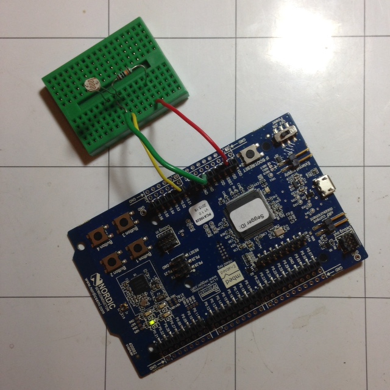
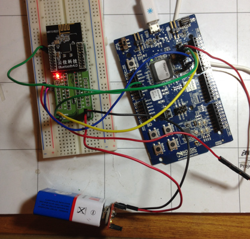
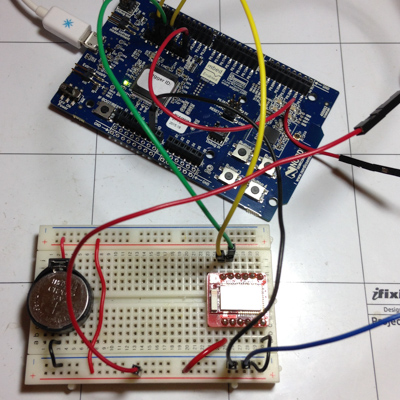

This is a simple demonstration of ADC and NUS (Nordic UART Service) using 
the nRF-DK board. ADC values are read in P0.01 where an LRD/resistor 
divider is connected. The read in values are sent over NUS. In addition, 
LED2 is also flashed.

http://electronut.in/nrf51-adc-test/

### nRF51-DK

### nRF51822 Breakout Board

### RedBearLab Nano

